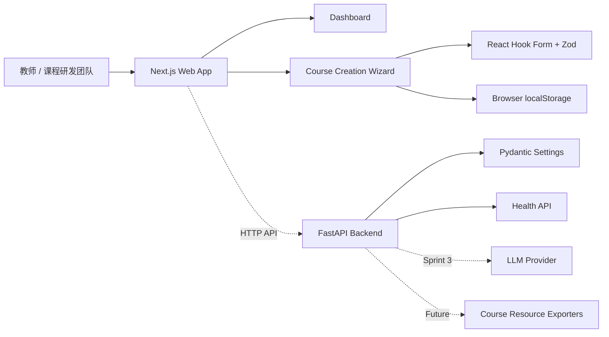

<div align="center">

# EduFlow AI

**面向教师、课程研发人员与培训团队的 AI 课程研发工作台。**

把零散的课程想法整理成结构化需求，并逐步推进到教案、讲义、课件、练习与完整课程包。


</div>

> [!NOTE]
> EduFlow AI 当前处于早期产品验证阶段。v0.1 已完成课程工作台、课程创建向导与本地草稿闭环；AI 课程生成、持久化与导出能力正在 Roadmap 中推进。

## 产品背景

课程研发通常分散在文档、表格、演示文稿和即时沟通中。教师与课程团队需要反复整理教学目标、学员画像、课时规划、教学风格和资源清单，随后再把相同背景信息复制到不同工具中生产内容。

EduFlow AI 希望把这条链路收拢到一个统一工作台：先用结构化流程澄清课程需求，再由 AI 协助生成、迭代和交付课程资源。产品强调三个原则：

- **结构先于生成**：先明确课程目标和约束，再进入内容生产。
- **过程持续可见**：课程状态、资源进度和交付记录集中管理。
- **教师保持控制**：AI 提供研发加速，最终教学决策仍由使用者掌握。

## 核心功能

| 能力 | 当前实现 |
| --- | --- |
| 课程研发 Dashboard | 课程指标、最近课程、生成状态与最近导出的统一视图 |
| 五步课程创建向导 | 基础信息、目标学员、课程规划与教学风格、资源选择、最终确认 |
| 结构化需求校验 | React Hook Form 与 Zod 驱动的分步校验和错误定位 |
| 本地草稿 | 自动保存、恢复、清除以及离开页面前持久化 |
| 工作台联动 | 当前设备上的课程草稿自动显示在最近课程中，并可继续编辑 |
| API 基础设施 | FastAPI 应用工厂、环境配置、CORS 与健康检查接口 |
| 工程质量 | Vitest、Testing Library、Pytest、ESLint 与生产构建检查 |

## 产品预览

截图将在后续版本随真实产品流程持续补充。建议使用 16:9 桌面截图，并统一存放在 `assets/screenshots/`。

| Dashboard | Course Creation Wizard |
| :---: | :---: |
| **截图占位**<br><sub>`assets/screenshots/dashboard.png`</sub> | **截图占位**<br><sub>`assets/screenshots/course-wizard.png`</sub> |

| Course Brief Review | Responsive Experience |
| :---: | :---: |
| **截图占位**<br><sub>`assets/screenshots/course-review.png`</sub> | **截图占位**<br><sub>`assets/screenshots/mobile.png`</sub> |

## 技术架构



当前版本采用前后端分离结构：Next.js 承担产品界面和本地草稿体验，FastAPI 提供后续 AI 编排、课程持久化和资源导出的服务边界。图中的虚线能力属于后续版本规划。

## 技术栈

| 层级 | 技术 |
| --- | --- |
| Web Framework | Next.js 16、React 19、App Router、TypeScript |
| UI System | Tailwind CSS 4、shadcn/ui、Radix UI、Lucide Icons |
| Form & Validation | React Hook Form、Zod |
| Frontend Testing | Vitest、Testing Library、jsdom |
| Backend | FastAPI、Uvicorn、Pydantic、Pydantic Settings |
| Backend Testing | Pytest、HTTPX |
| Local Persistence | Browser localStorage |
| Package Management | pnpm、Python venv / pip |
| Development Runtime | Next.js Webpack dev server（规避当前 Turbopack HMR 稳定性问题） |

## 项目结构

```text
EduFlow AI/
├── frontend/
│   ├── app/                       # Next.js 路由与页面
│   ├── components/                # 通用布局与 UI 组件
│   ├── features/
│   │   ├── course-wizard/         # 课程创建向导、校验与草稿逻辑
│   │   └── dashboard/             # 工作台与课程摘要
│   ├── tests/                     # 前端单元与交互测试
│   └── types/                     # 共享 TypeScript 类型
├── backend/
│   ├── models/                    # Pydantic 数据模型
│   ├── routers/                   # FastAPI 路由
│   ├── services/                  # 业务服务边界
│   ├── prompts/                   # AI Prompt 模块预留
│   └── exporters/                 # 课程资源导出模块预留
├── tests/backend/                 # 后端测试
├── assets/                        # 项目截图与展示资源
├── temp/                          # 本地生成文件（不会提交）
├── .env.example                   # 后端环境变量模板
└── requirements.txt               # Python 依赖
```

## 本地运行

### 环境要求

- Node.js 20.9+
- pnpm 11 或兼容版本
- Python 3.11+

### 1. 克隆项目

```bash
git clone https://github.com/RyanBao9527/eduflow-ai.git
cd eduflow-ai
```

### 2. 启动前端

```bash
cd frontend
cp .env.local.example .env.local
pnpm install
pnpm dev
```

前端默认运行在 [http://localhost:3000](http://localhost:3000)：

- Dashboard：`http://localhost:3000/dashboard`
- 新建课程：`http://localhost:3000/courses/new`

### 3. 启动后端

在项目根目录执行：

```bash
cp .env.example .env
python3 -m venv .venv
source .venv/bin/activate
python -m pip install -r requirements.txt
python -m uvicorn backend.main:app --reload --port 8000
```

后端服务：

- 健康检查：[http://127.0.0.1:8000/health](http://127.0.0.1:8000/health)
- OpenAPI 文档：[http://127.0.0.1:8000/docs](http://127.0.0.1:8000/docs)

## 环境变量

不要提交真实的 `.env` 或 `frontend/.env.local`。仓库仅保留可安全复制的示例文件。

### Backend · `.env`

| 变量 | 说明 | 当前用途 |
| --- | --- | --- |
| `APP_NAME` | FastAPI 应用名称 | 已启用 |
| `APP_ENVIRONMENT` | `development` / `test` / `production` | 已启用 |
| `CORS_ORIGINS` | 允许访问 API 的前端地址列表 | 已启用 |
| `OPENAI_API_KEY` | 模型服务 API Key | 预留，v0.1 不调用模型 |
| `OPENAI_BASE_URL` | OpenAI-compatible API 地址 | 预留 |
| `OPENAI_MODEL` | 模型名称 | 预留 |
| `REQUEST_TIMEOUT` | 模型请求超时秒数 | 预留 |
| `MAX_CONTEXT_LENGTH` | 最大上下文长度 | 预留 |
| `TEMP_DIR` | 本地生成文件目录 | 导出模块预留 |

### Frontend · `frontend/.env.local`

| 变量 | 说明 | 示例 |
| --- | --- | --- |
| `NEXT_PUBLIC_API_BASE_URL` | FastAPI 服务地址 | `http://127.0.0.1:8000` |

## 开发检查

```bash
# Frontend
cd frontend
pnpm lint
pnpm test
pnpm build

# Backend（项目根目录）
source .venv/bin/activate
python -m pytest tests/backend
```

当前自动化测试覆盖课程需求 Schema、向导分步校验、本地草稿恢复与清除、Dashboard 本地课程映射，以及后端健康检查。

## Roadmap

- [x] **Foundation** — 前后端工程骨架、设计系统与基础质量工具
- [x] **Course Intake** — Dashboard、五步课程创建向导、本地草稿闭环
- [ ] **AI Course Blueprint** — 根据结构化需求生成课程目标、课时结构和资源计划
- [ ] **Course Workspace** — 课程详情、版本编辑、生成状态与资源管理
- [ ] **Content Generation** — 教案、讲稿、讲义、课件、练习与测验生成
- [ ] **Export Pipeline** — Word、PowerPoint、Excel 与课程包导出
- [ ] **Product Platform** — 数据库、登录、团队协作、权限与可观测性

## Sprint 开发记录

| Sprint | 目标 | 交付结果 | 状态 |
| --- | --- | --- | :---: |
| Sprint 1 | 建立可运行的产品骨架 | Next.js、FastAPI、Dashboard、设计系统、健康检查 | ✅ |
| Sprint 2 | 跑通课程需求采集 | 五步向导、Schema 校验、错误摘要、本地草稿、Dashboard 联动 | ✅ |
| Engineering | 提升开发环境稳定性 | 自动保存循环防护、Turbopack 切换 Webpack、回归测试 | ✅ |
| Sprint 3 | 生成 AI 课程蓝图 | API 契约、Prompt、模型服务、结构化课程方案 | Planned |

## 当前版本边界

v0.1 聚焦课程需求采集与产品流程验证，Dashboard 中部分课程与导出数据为演示数据。当前版本不会发送模型请求，也不包含数据库、登录、支付、RAG、团队协作或正式资源导出。

---

<div align="center">
  <strong>EduFlow AI</strong><br />
  <sub>From course idea to structured delivery.</sub>
</div>
