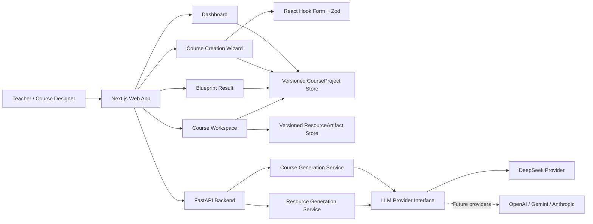

<div align="center">

# EduFlow AI

### AI-powered course development platform

将课程想法转化为结构化 AI Course Blueprint，并在可编辑的 Course Workspace 中持续管理和完善。

[](https://github.com/RyanBao9527/eduflow-ai/tree/v0.4.0)


</div>

> [!NOTE]
> **Current Version: v0.4.0 — AI Resource Generation MVP.** 支持在 Course Workspace 中为单个课时生成、保存和预览教师教案与 PPT 课件内容结构。

## Product Positioning

EduFlow AI 是面向教师、课程研发人员和培训团队的 AI 课程研发平台。它把分散在文档、表格和对话中的课程需求整理为稳定、可扩展的课程结构，让 AI 生成结果不再是一次性文本，而是可以持续编辑和扩展的课程项目资产。

### 解决的问题

- **课程需求缺少结构**：教学目标、学员画像、课时安排和资源需求往往散落在不同工具中。
- **AI 输出难以持续使用**：一次性生成的大纲缺少稳定 ID、项目状态和后续编辑入口。
- **长课程生成成本不稳定**：超大响应容易重复、截断，并消耗不必要的 Token。
- **模型与业务容易耦合**：直接绑定单一模型会增加后续效果和成本比较的改造成本。

### 当前工作流

```text
Course Wizard
→ AI Course Blueprint
→ Save as CourseProject
→ Course Workspace
→ Generate lesson resources
→ Preview current and historical ResourceArtifacts
```

## Features

| 能力 | 当前实现 |
| --- | --- |
| Course Creation Wizard | 五步收集课程背景、目标学员、课程规模、教学风格和后续资源规划 |
| AI Course Blueprint | 1–20 课时生成详细蓝图，21–50 课时生成模块、阶段、完整索引与关键课时 |
| Structured AI Output | Prompt v3、JSON Output、Pydantic 校验、重复课时检查和截断保护 |
| Model-agnostic LLM Layer | 统一 LLM Provider 接口，当前接入 DeepSeek，模型信息由环境变量配置 |
| CourseProject | 使用稳定 UUID、`schemaVersion`、状态和生成元数据封装课程资产 |
| Local Persistence | 多个课程项目保存到 localStorage，并兼容迁移旧草稿与 session 蓝图 |
| Course Workspace | 编辑课程标题、总体目标、模块名称、课时标题和课时描述 |
| Lesson-level Resource Generation | 为指定课时生成教师教案或 PPT 课件内容结构 |
| ResourceArtifact | 独立保存资源内容、生成元数据、稳定 UUID 和最近三个版本 |
| Workspace Resource Preview | 只读查看最新资源、生成模型、Token 使用和历史版本 |
| Dashboard Management | 展示本地课程项目、状态、更新时间和对应的继续操作入口 |
| Data-loss Protection | 自动保存、显式 Workspace 保存、未保存离开提醒和存储异常回退 |
| Engineering Quality | Vitest、Testing Library、Pytest、ESLint 和 Next.js production build |

## Product Preview

截图将在后续版本随真实产品流程持续补充，并统一存放在 `assets/screenshots/`。

| Dashboard | Course Creation Wizard |
| :---: | :---: |
| **Screenshot placeholder**<br><sub>`assets/screenshots/dashboard.png`</sub> | **Screenshot placeholder**<br><sub>`assets/screenshots/course-wizard.png`</sub> |

| AI Course Blueprint | Course Workspace |
| :---: | :---: |
| **Screenshot placeholder**<br><sub>`assets/screenshots/course-blueprint.png`</sub> | **Screenshot placeholder**<br><sub>`assets/screenshots/course-workspace.png`</sub> |

## Architecture



Next.js 负责课程向导、结果预览、Dashboard、Workspace 与浏览器本地持久化；FastAPI 负责课程生成业务、Prompt、模型调用和结构校验。课程业务只依赖统一的结构化 LLM 接口，不直接绑定 DeepSeek。

### CourseProject 数据边界

```text
CourseProject
├── schemaVersion: "1.0"
├── id / status / timestamps
├── courseBrief
├── coursePlan
└── generation metadata
```

MVP 不使用数据库。CourseProject repository 隔离了存储细节，后续接入持久化 API 时可以保留 Workspace 组件和稳定数据结构。

ResourceArtifact 使用独立的版本化 localStorage repository，通过 `courseProjectId`、`lessonId` 和 `resourceType` 关联课程项目。资源不会嵌入或改写 CourseProject。

## Tech Stack

| Layer | Technologies |
| --- | --- |
| Frontend | Next.js 16, React 19, App Router, TypeScript |
| UI | Tailwind CSS 4, shadcn/ui, Radix UI, Lucide Icons |
| Forms & Validation | React Hook Form, Zod |
| Backend | FastAPI, Uvicorn, Pydantic, Pydantic Settings |
| AI Integration | Model-agnostic Provider Protocol, DeepSeek, structured JSON output |
| Persistence | Browser localStorage and sessionStorage compatibility fallback |
| Testing | Vitest, Testing Library, jsdom, Pytest, HTTPX |
| Tooling | pnpm, Python venv, ESLint, Next.js Webpack development server |

## Current Version

### v0.4.0 — AI Resource Generation MVP

v0.4.0 将课程蓝图扩展为可在单课维度生成和管理 AI 教学资源的 Workspace 工作流。

Highlights:

- Lesson-level AI resource generation.
- Teacher lesson plan generation.
- Slide outline generation.
- Independent ResourceArtifact version management.
- Read-only Workspace resource preview with generation metadata and historical versions.

Not included:

- PPT file generation.
- Word export.
- Excel export.
- Download or file export.
- Database or authentication.
- RAG or Agent capabilities.

## Roadmap

### v0.1.0 — Foundation

- Next.js + FastAPI.
- Course Wizard.
- Basic frontend and backend architecture.

### v0.2.0 — AI Course Blueprint

- LLM Provider abstraction.
- DeepSeek integration.
- Structured course generation.

### v0.2.1 — Resource Planning

- Resource planning model.
- Prompt v3.
- Course-level resource purpose and scope planning.

### v0.3.0 — Course Workspace

- CourseProject architecture.
- Local persistence.
- Editable Course Workspace.
- Dashboard project management.

### v0.4.0 — AI Resource Generation MVP

- Lesson-level teacher lesson plan generation.
- Slide outline generation.
- ResourceArtifact local persistence and version management.
- Read-only Workspace resource preview.

### Next

- **Sprint 6 — Export Center:** 集中管理和导出课程资源。
- **Sprint 7 — Knowledge Base / RAG:** 知识检索、来源约束和引用增强。

## Local Development

### Requirements

- Node.js 20.9+
- pnpm 11 或兼容版本
- Python 3.11+

### Clone

```bash
git clone https://github.com/RyanBao9527/eduflow-ai.git
cd eduflow-ai
```

### Frontend

```bash
cd frontend
cp .env.local.example .env.local
pnpm install
pnpm dev
```

前端默认运行在 [http://localhost:3000](http://localhost:3000)：

- Dashboard：`/dashboard`
- 新建课程：`/courses/new`
- 课程蓝图：`/courses/result?projectId={id}`
- Course Workspace：`/courses/{id}`

### Backend

在项目根目录执行：

```bash
cp .env.example .env
python3 -m venv .venv
source .venv/bin/activate
python -m pip install -r requirements.txt
python -m uvicorn backend.main:app --reload --port 8000
```

- Health check：[http://127.0.0.1:8000/health](http://127.0.0.1:8000/health)
- OpenAPI docs：[http://127.0.0.1:8000/docs](http://127.0.0.1:8000/docs)

### Environment Variables

不要提交真实的 `.env` 或 `frontend/.env.local`。

Backend `.env`：

| Variable | Purpose |
| --- | --- |
| `APP_NAME` / `APP_ENVIRONMENT` | FastAPI application configuration |
| `CORS_ORIGINS` | Allowed frontend origins |
| `LLM_PROVIDER` | Active LLM provider identifier |
| `LLM_MODEL` | Model configured for the active provider |
| `LLM_BASE_URL` | Provider API base URL |
| `LLM_API_KEY` | Server-only API key; never expose to the frontend |
| `LLM_REQUEST_TIMEOUT` | Model request timeout |
| `LLM_MAX_OUTPUT_TOKENS` | Maximum completion token budget |
| `LLM_TEMPERATURE` | Structured generation temperature |
| `MAX_GENERATED_JSON_BYTES` | Maximum accepted generated JSON size |

Frontend `frontend/.env.local`：

| Variable | Example |
| --- | --- |
| `NEXT_PUBLIC_API_BASE_URL` | `http://127.0.0.1:8000` |

### Validation

```bash
# Frontend
cd frontend
pnpm test
pnpm lint
pnpm build

# Backend — from repository root
source .venv/bin/activate
python -m pytest tests/backend -q
```

## Project Structure

```text
EduFlow AI/
├── frontend/
│   ├── app/                       # Next.js routes and pages
│   ├── components/                # Shared layout and UI components
│   ├── features/
│   │   ├── course-wizard/         # Course intake and draft flow
│   │   ├── course-generation/     # AI API, schemas and blueprint result
│   │   ├── course-resources/      # Resource generation, artifacts and read-only results
│   │   ├── course-workspace/      # CourseProject storage, migration and editor
│   │   └── dashboard/             # Local project management
│   ├── tests/                     # Frontend unit and interaction tests
│   └── types/                     # Shared TypeScript types
├── backend/
│   ├── models/                    # Pydantic request and response models
│   ├── routers/                   # FastAPI routes
│   ├── services/                  # Course/resource generation and LLM providers
│   └── prompts/                   # Versioned course and resource prompts
├── tests/backend/                 # Backend regression tests
├── assets/                        # Project screenshots and presentation assets
├── .env.example                   # Backend environment template
└── requirements.txt               # Python dependencies
```

---

<div align="center">
  <strong>EduFlow AI</strong><br />
  <sub>From course idea to structured delivery.</sub>
</div>
